- - -
<div style="
    background-color: #4fc3f7;
    border-radius: 8px;
    padding: 20px;
    border: 2px solid #0288d1;
    box-shadow: 0 4px 8px rgba(0, 0, 0, 0.1);
    margin: 20px 0;
">
<h1 style="
    color: white;
    text-align: center;
    margin: 0;
    padding: 10px;
    text-shadow: 1px 1px 3px rgba(0, 0, 0, 0.3);
">Spanning Tree Protocol</h1>
</div>
---

> **note – Objectif :**
> Au cours de ce TP, on cherche à mettre en oeuvre le protocole Spanning Tree afin d'avoir un lien de secours qui prendrai le relaie en cas de coupure.

> **note – Réseau :**
>On commence par réaliser la maquette du réseau sur lequel on veut mettre en place une redondance.
>
>
>
>On configure les équipement réseaux en suivant ce tableau :
>
>| Equipement | Adresse IP      | VLAN |
| ---------- | --------------- | ---- |
| PC 1       | 192.168.20.2/24 | 20   |
| PC 2       | 192.168.10.2/24 | 10   |
| PC 4       | 192.168.20.4/24 | 20   |
| PC 5       | 192.168.10.5/24 | 10   |
>

> **TIP – Exemple :**
>Configuration IP PC1 :
>
>


> **note – Configuration Switchs :**
>On configure maintenant les 3 Switchs de ce réseau
>
>On commence par définir quelles interfaces seront utilisé :
>
>| Switch | Interface | Equipement associé |
| ------ | --------- | ------------------ |
| SW1    | fa0/1     | SW2                |
| SW1    | fa0/3     | SW3                |
| SW2    | fa0/5     | SW3                |
| SW2    | fa0/2     | PC2                |
| SW2    | fa0/3     | PC1                |
| SW2    | fa0/1     | SW1                |
| SW3    | fa0/1     | SW2                |
| SW3    | fa0/3     | SW1                |
| SW3    | fa0/4     | PC4                |
| SW3    | fa0/5     | PC5                |

> **tip – Configuration Switch :**
>
>On va créer les VLAN sur les switch, pour gagner du temps on utilise le protocole VTP, voir TP B1 VTP.
>
>On crée les deux vlan 10 et 20 puis on attribuent les ports PC aux VLAN.
>
>Enfin, on fait les liaison Trunk entre les switch, entre le SW1 et SW2 ainsi que SW1 et SW3 ont autorise le VLAN 20 et entre SW2 et SW3 on autorise le VLAN 10.

> **caution – Problème :**
>Le réseau est défini mais on fait face à une tempête de brodcatst. Pour y remédier on va utiliser le STP.
>
>On remarque le problème avec le point orange sur ce schéma réseau :

> **note – Configuration VSTP :**
>Pour remedier au problème, on configure le VLAN STP :
>
>On commence par effacer toutes les traces d'éventuels STP existant :
>
>```
>Switch(config)#no spanning-tree vlan 1-1000
>```
>
>Puis on entre cette commande pour la mise en place du protocole :
>```
>Switch(config)#spanning-tree mode pvst
>```
>
>Enfin on déclare chaque VLAN au protocole avec cette commandes :
>```
>Switch(config)#spanning-tree vlan 10,20
>```

---
## Tests :

> **tip – Question :**
>Est ce que le STP fonctionne ? Comment le prouvez-vous ?

> **note – Réponse :**
>Le STP fonctionne, pour le prouver, on utilise la commande show spanning-tree :
>
>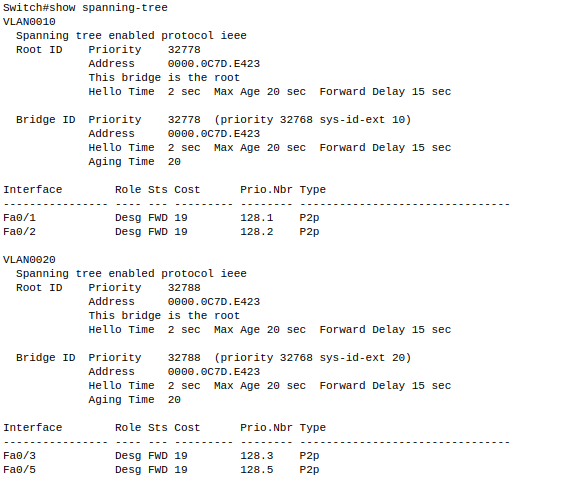

> **note – Commande show spanning-tree :**
>
>**Quel est l'adresse de chaque switch ?**
>
>La commande show spanning-tree permet de connaître l'adresse mac de chaque switch
>
>SW1 : 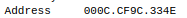
>
>SW2 : 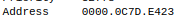
>
>SW3 : 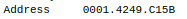
>
>**Pour chaque VLAN, quel est le switch racine ? Pourquoi a-t-il été élu ?**
>
>Pour les deux VLAN le switch racine est le switch 2 comme le montre la commande show spanning-tree :
>
>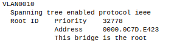
>
>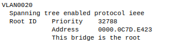
>
>On observe que quand on tape cette commande dans SW2 on observe : this bridge is the root
>
>Sur les autres switchs on observe que l'adresse mac du switch root correspond bien à celle de SW2 :
>
>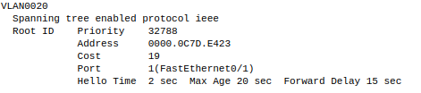
>
>**Pourquoi les coûts (cost) que l’on observe pour le VLAN 20 ne sont pas les mêmes partout ?**
>
>Les cost que l'on observe sont les mêmes partout car ils dépendent de la vitesse des liens, or on utilise des liens qui ont tous la même vitesse de débit :
>
>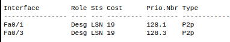
>
>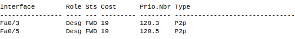
>
>**Quelle est la priorité des ports à 100Mb/s?**
>
>On remarque que la priorité des ports 100Mb/s est de *128.numéro_de_port*

> **note – Graphe des VLAN :**
>

> **note – Port des Switchs :**
>
>**Le fait qu’aucun port des switchs ne soit bloqué est-il normal ?**
>
>Oui car il n'y a pas de redondance, tout les ports sont nécéssaires et donc en état de forwarding.

---
## Redondance :

> **tip – Redondance :**
>On va maitenant mettre en place une redondance sur ce réseau. On ajoute un lien Gigabit 0/1 trunké pour le VLAN 10 et 20 entre SW2 et SW3

> **note – Question :**
>**Pourquoi ajouter une liaison ?**
>
>On ajoute une liaison d'une part pour **améliorer la bande passante** en remplaçant le fastethernet par du gigabitéthernet 10 fois plus rapide et d'autre part **pour créer une redondance** qui fait que si une des liaisons venaient à être coupé le réseau continuerait de fonctionner.

> **note – Configuration redondance :**
>
>On commence par configurer le port pour une liaison Trunk qui autorise les vlans 10 et 20, on le fait sur les deux switch :
>
>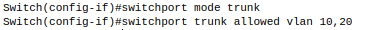
>
>Par la suite, on utilise cette commande :
>```
>Switch(config-if)#spanning-tree vlan 10-20 port-priority 64
>```
>
>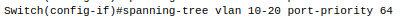
>
>La commande **Switch(config)#interface gigabitEthernet 0/1** permet de configurer l'interface gigabit 0/1
>
>La commande **Switch(config-if)#spanning-tree vlan 10-20 port-priority 64** permet de dooner la priorité du ports pour les deux VLAN sur le port g0/1

> **note – Ports Bloqués :**
>**Quels sont les ports bloqués suite à cette opération**
>
>On observe que les ports fa0/1 est bloqué sur SW3 pour le VLAN 10 et que les ports fa0/1 et g0/1 sont bloqués pour le vlan 20
>
>

> **note – SW1 :**
>**Le switch 1 est il actif ? Pourquoi ?**
>
>Le Switch 1 n'est plus actif afin de ne pas générer de boucle ce qui causerait une tempête de brodcast.

> **note – Connectivité entre les VLANs :**
>Pour le VLAN 10 comme pour le VLAN 20 les messages prennent la liason g0/1 entre SW2 et SW3 car les coûts sont inférieurs

> **note – Graphe des VLAN :**
>Graphe des switchs traversés pour les deux VLAN
>
>
>
>Graphe des switchs si le g0/1 n'était attribué que au VLAN20
>
>
