- - -
<div style="
    background-color: #4fc3f7;
    border-radius: 8px;
    padding: 20px;
    border: 2px solid #0288d1;
    box-shadow: 0 4px 8px rgba(0, 0, 0, 0.1);
    margin: 20px 0;
">
<h1 style="
    color: white;
    text-align: center;
    margin: 0;
    padding: 10px;
    text-shadow: 1px 1px 3px rgba(0, 0, 0, 0.3);
">Supervision Zabbix et PRTG</h1>
</div>
<br>

> **tip – HEGO Maxence**
>.png|%20center%20|175)
>
>.png|center|200)

---

> **note – Objectif :**
>Afin de renforcer la sécurité de notre **SI**, on souhaite mettre en place un **outil de supervision.** Lors de ce TP on va ainsi installer et tester deux outils de supervision : **Zabbix et PRTG** dans le but de les comparer et voir lequel est le plus adapter à nos besoins.

<br>
> **tip – Schéma :**
>Voici un schéma de notre architecture réseau comprenant les services que l'on veut monitorer :

<br>

---
<div style="
    background-color: #4fc3f7;
    border-radius: 4px;
    padding: 10px;
    border: 2px solid #0288d1;
    box-shadow: 0 4px 8px rgba(0, 0, 0, 0.1);
    margin: 30px 0;
">
<h1 style="
    color: white;
    text-align: center;
    margin: 0;
    padding: 20px;
    text-shadow: 1px 1px 3px rgba(0, 0, 0, 0.3);
">Partie 1 – Installation et configuration Zabbix</h1>
</div>
---

> **tip – Note :**
>On commence par tester Zabbix, voyons comment installer et configurer ce service dans l'objectif de monitorer notre SI.

<br>

---

<div style="
    background-color: #80deea;
    border-radius: 4px;
    padding: 10px;
    border: 2px solid #0288d1;
    box-shadow: 0 4px 8px rgba(0, 0, 0, 0.1);
    margin: 30px 0;
">
<h1 style="
    color: white;
    text-align: center;
    margin: 0;
    padding: 20px;
    text-shadow: 1px 1px 3px rgba(0, 0, 0, 0.3);
">Partie A – Installation Zabbix</h1>
</div>
---
<br>
#### a. Installation console bash :

> **tip – Note :**
>On installe le serveur Zabbix sur une debian 12, on suit ce tutoriel disponible sur le site de zabbix : https://www.zabbix.com/download?os_distribution=debian

> **note – Installation BDD :**
>Mise à jour du système :
>```bash
>apt update && apt upgrade -y
>```
>Installation de la base de données, on choisi mariadb :
>```bash
>apt install mariadb-server mariadb-client -y
>```
>Terminer installation de Mariadb :
>```bash
>mysql_secure_installation
>```

> **note – Installation des dépendances :**
>```bash
>apt install apache2 php php-mysql php-mysqli php-ldap php-bcmath php-mbstring php-gd php-xml php-curl -y
>```

> **note – Ajout du repository Zabbix :**
>```bash
>wget https://repo.zabbix.com/zabbix/6.4/debian/pool/main/z/zabbix-release/zabbix-release_6.4-1+debian12_all.deb
>```
>```bash
>dpkg -i zabbix-release_6.4-1+debian12_all.deb
>```
>```bash
>apt update
>```

> **note – Installation de Zabbix server, Frontend et Agent :**
>```bash
>apt install zabbix-server-mysql zabbix-frontend-php zabbix-apache-conf zabbix-sql-scripts zabbix-agent -y
>```

> **note – Configuration de la BDD :**
>```bash
>mysql -u root -p
>```
>Dans mariadb :
>```sql
>CREATE DATABASE zabbix CHARACTER SET utf8mb4 COLLATE utf8mb4_bin;
>CREATE USER 'zabbix'@'localhost' IDENTIFIED BY 'sio%2025';
>GRANT ALL PRIVILEGES ON zabbix.* TO 'zabbix'@'localhost';
>FLUSH PRIVILEGES;
>EXIT;
>```

> **note – Importation du schéma de la BDD :**
>```bash
>zcat /usr/share/zabbix-sql-scripts/mysql/server.sql.gz | mysql -uzabbix -p zabbix
>```

> **note – Configuration de Zabbix Server :**
>```bash
>nano /etc/zabbix/zabbix_server.conf
>```
>Dans le fichier de configuration on change ces lignes :
>```ini
>DBHost=localhost
DBName=zabbix
DBUser=zabbix
DBPassword=votre_mot_de_passe_securise
>```

> **note – Activation des services :**
>```bash
>systemctl restart apache2
>systemctl enable zabbix-server zabbix-agent
>systemctl start zabbix-server zabbix-agent
>```

<br>
#### b. Installation interface web :

> **note – Interface Web :**
>On vérifie que l'installation fonctionne en se connectant à l'interface web : http://192.168.20.109/zabbix (IP de notre serveur Zabbix)
>
>
>
>On arrive sur cette page d’accueil :
>
>
>
>On vérifie que tout les prérequis sont bien installés :
>
>
>
>On configure la connexion à la BDD:
>
>
>
>On nomme maintenant notre serveur Zabbix :
>
>
>
>On termine l'installation :
>
>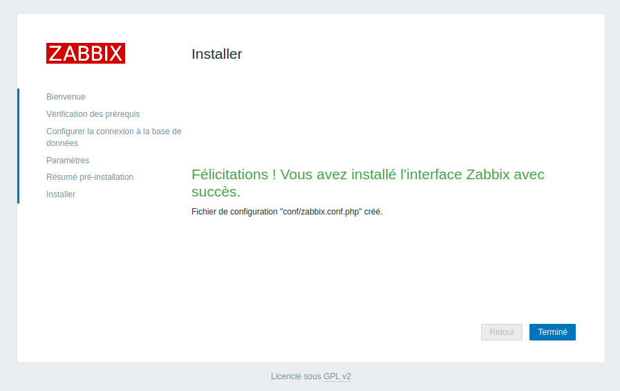

> **note – Connexion Interface Web :**
>On peut maintenant se connecter à la pge de monitoring.
>
>On entre le login et le mot de passe : **Admin** et **zabbix**
>
>
>
>On arrive sur cette page d'acceuil :
>
>

<br>

---

<div style="
    background-color: #80deea;
    border-radius: 4px;
    padding: 10px;
    border: 2px solid #0288d1;
    box-shadow: 0 4px 8px rgba(0, 0, 0, 0.1);
    margin: 30px 0;
">
<h1 style="
    color: white;
    text-align: center;
    margin: 0;
    padding: 20px;
    text-shadow: 1px 1px 3px rgba(0, 0, 0, 0.3);
">Partie B – Installation des agents</h1>
</div>
---
<br>
> **note – Objectif :**
>On veut maintenant installer les agents sur les différents machines que l'on va monitorer afin de recevoir la data.
>On veut installer un agent sur une VM Linux, une VM windows 11 et un serveur Linux. Pour le serveur Linux on va monitorer un serveur LAMP.
<br>
#### a. Installation agent sur VM Linux :

> **tip – Note :**
>On commence par installer l'agent sur la VM Linux. La VM est une debian 12 sans interface graphique.

> **note – Installation Agent :**
>On installe l'agent Zabbix :
>```bash
>apt update
>apt install zabbix-agent
>```
>

> **note – Fichier de configuration :**
>On modifie ces lignes dans le fichier de configuration :
>```bash
>nano /etc/zabbix/zabbix_agentd.conf
>```
>```ini
>Server=192.168.1.109
ServerActive=192.168.1.109
Hostname=Linux-client
>```
>
>
>
>
>
>
>
>On redemare et on active l'agent :
>```bash
>systemctl restart zabbix-agent
>systemctl enable zabbix-agent
>```
>
>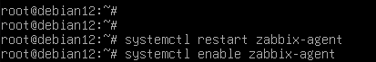

> **note – Ajout agent depuis interface web :**
>Maintenant que l'agent est installé, on veut créer l'hôte sur l'interface web.
>
>Depuis l'interface Web, on va dans Surveillance > Hôtes :
>
>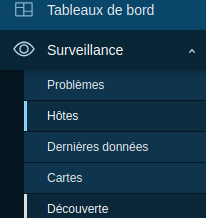
>
>On arrive sur cette page, on sélectionne créer un hôte en haut à droite :
>
>
>
>
>On défini le nom du nouvel hôte :
>
>
>
>Puis on défini le modèle de template :
>
>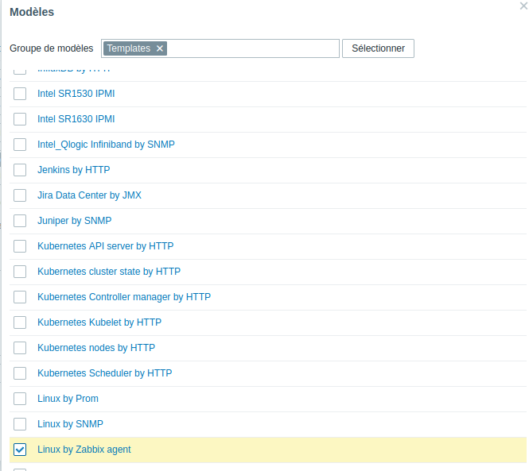
>
>On choisi ensuite dans quel groupe on met la machine :
>
>
>
>On va maintenant ajouter l'interface :
>
>
>
>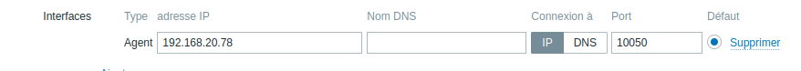
>
>On termine l'installation en cliquant sur ajouter :
>
>
>
>On a bien un nouvel agent qui apparaît :
>
>
<br>
#### b. Installation agent serveur LAMP :

> **tip – Note :**
>On va maintenant installer un agent sur un serveur LAMP. La procédure d'installation est identique que lors de l'installation de l'agent sur la VM debian 12. La seule chose qui change est lors de la création de l'hôte sur l'interface web de zabbix.

> **note – Ajout agent depuis interface Web :**
>On suit la même procédure en nommant l'hôte puis, lors de la sélection des modèles de template, on sélectionne Appache by zabbix agent et mysql ny zabbix agent en plus de Linux by zabbix agent :
>
>
>
>
>
>Par la suite on ajoute l'interface comme précédemment. On peut maintenant ajouter ce nouvel hôte :
>
>
>
>Le serveur LAMP apparaît bien dans les hôtes surveillés :
>
>
<br>
#### c. Installation agent Windows 11 :

> **tip – Note :**
>On passe maintenant à l'installation de l'agent sur la VM Windows 11.

> **note – Installation agent :**
>On commence par aller sur le site de Zabbix depuis un naviguateur web pour télecharger l'agent. Le site : https://www.zabbix.com/download_agents?version=6.4&distribution=windows&architecture=64bit&package=msi
>
>
>
>On lance ensuite le programme d'installation :
>
>
>
>Lors de l'installation, on renseigne le nom d'hôte de la VM Windows11 puis on entre l'adresse IP du serveur Zabbix :
>
>
>
>On peut vérifier que le service fonctionne en allant dans service :
>
>

> **note – Ajout agent depuis interface web :**
>Même procéde que pour les agents Linux, on change juste le template utilisé :
>
>
>
>
>
>

<br>
> **tip – Note :**
>On a maintenant pu remonter les données en utilisant les agents bla bla bla, on va maintenant faire en utilisant snmp.
<br>

---

<div style="
    background-color: #80deea;
    border-radius: 4px;
    padding: 10px;
    border: 2px solid #0288d1;
    box-shadow: 0 4px 8px rgba(0, 0, 0, 0.1);
    margin: 30px 0;
">
<h1 style="
    color: white;
    text-align: center;
    margin: 0;
    padding: 20px;
    text-shadow: 1px 1px 3px rgba(0, 0, 0, 0.3);
">Partie C – SNMP</h1>
</div>
---
<br>
> **note – Objectif :**
>On va maintenant utiliser snmp pour surveiller une machine Windows server 2019 et un switch.
<br>
#### a. Installation de SNMP sur Windows

> **note – Installation SNMP :**
>Dans le server manager, on clique sur gérer puis ajouter des rôles et fonctionnalités :
>
>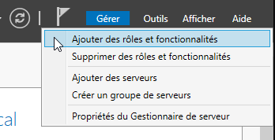
>
>Dans fonctionnalité, on ajoute le service snmp :
>
>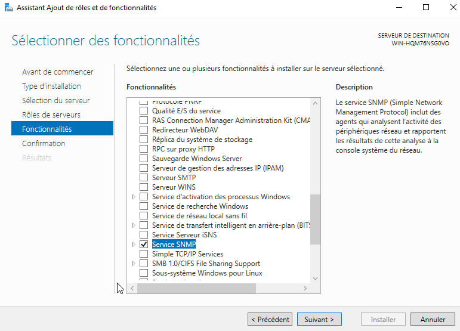

> **note – Configuration SNMP :**
>On va maintenant dans Outils > Service :
>
>
>
>On double clique sur service SNMP :
>
>
>
>Dans l'onglet sécurité, on accepte les paquets SNMP provenant de n'importe quelle hôte :
>
>
>
>Puis on ajoute une communauté, je la nomme Zabbix :
>
>
>
>On va ensuite dans interruption et pour la communauté Zabbix on ajoute l'adresse IP du serveur Zabbix :
>
>

> **note – Configuration depuis interface Web :**
>On peut maintenant depuis l'interface Web ajouter un nouvel hôte pour le Windows Server.
>
>Comme pour la VM Windows, on défini le nom, on attribue un groupe et un modèle de template, on prends comme modèle Windows by SNMP.
>
>On ajoute ensuite une interface SNMP :
>
>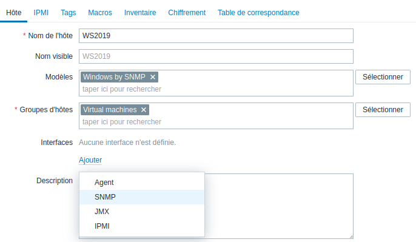
>
>On entre alors l'IP du Windows Server :
>
>
>
>On obtient bien les informations pour le Windows Server :
>
>
<br>
#### b. Installation SNMP sur Switch :

> **note – Configuration Switch :**
>On veut maintenant pouvoir surveiller un switch. On commence par la configuration du switch.
>
>On commence par se connecter au switch en mode console en utilisant putty :
>
>
>
>On met en place un accès telnet en définissant une ip pour le Vlan 1 :
>
>
>
>
>
>
>
>On peut maintenant se connecter en telnet :
>
>
>
>On peut maintenant configurer le snmp avec le nom de la communauté :
>
>
>
>On défini ensuite l'adresse de l'hôte :
>
>

> **note – Configuration depuis interface Web :**
>On passe maintenant à la configuration depuis l'interface web :
>
>
>
>
>
>
>
>Dans macros on entre le nom de la commmunauté :
>
>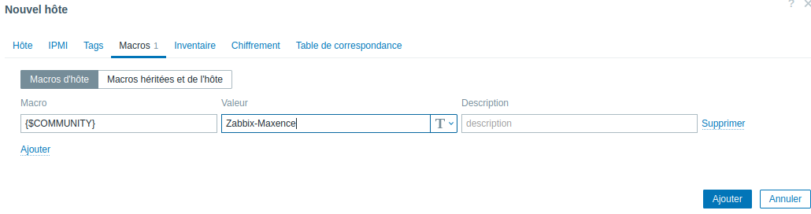
>
>Le switch apparaît bien :
>
>

> **note – Tout les équipements :**
>On observe que tout les équipements apparaissent bien, la supervision fonctionne.
>
<br>

---

<div style="
    background-color: #80deea;
    border-radius: 4px;
    padding: 10px;
    border: 2px solid #0288d1;
    box-shadow: 0 4px 8px rgba(0, 0, 0, 0.1);
    margin: 30px 0;
">
<h1 style="
    color: white;
    text-align: center;
    margin: 0;
    padding: 20px;
    text-shadow: 1px 1px 3px rgba(0, 0, 0, 0.3);
">Partie D – Alertes et interfaces</h1>
</div>
---
<br>
> **tip – Note :**
>On veut maintenant faire en sorte de pouvoir recevoir des alertes lorsque un problème se présente. Voyons comment faire.

> **note – Configuration boite mail :**
>Avant toute chose, on doit configurer la boite mail de l'admin qui reçoit les mails. On utilise un compte gmail.
>
>On va dans paramètres > sécurité :
>
>
>
>On active la validation à deux étapes :
>
>
>
>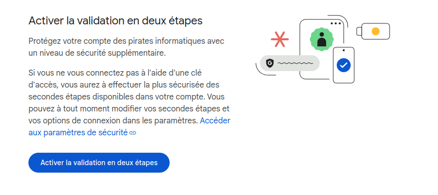
>
>On se rend ensuite sur ce lien : https://myaccount.google.com/apppasswords et on génere un nouveau mot de passe pour une application que l'on garde de coté.
>
>

> **note – Configuration SMTP :**
>Pour pouvoir recevoir des mails on a besoin d'installer un serveur SMTP. On l'installe sur la VM qui héberge le Zabbix.
>
>
>
>On modifie ensuite le fichier de configuration :
>
>
>
>On entre les informations suivantes : notre mail, le hubmail et le mot de passe que l'on a génère précédemment.
>
>
>
>On réalise un test pour vérifier que le service fonctionne bien :
>
>
>
>
>
>C'est bon le service ssmtp fonctionne.

> **note – Alerte Mail :**
>On veut activer les alertes par mail.
>
>On va dans Alerte > Type de média:
>
>
>
>On décide d'activer les alertes par mail :
>
>
>
>On configure maintenant le média mail en entrant le serveur SMTP et en entrant notre courriel :
>
>
>
>On fait maintenant un test pour vérifier que le nouveau média est bien pris en compte :
>
>
>
>

> **note – Utilisateur alerté :**
>On décide maintenant quelle est l'utilisateur qui reçoit les mail, pour nous ce sera l'administrateur :
>
>On va dans Utilisateurs > utilisateurs :
>
>
>
>On sélectionne ensuite l'admin :
>
>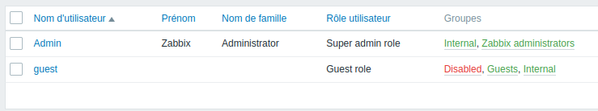
>
>On va dans média et on fait ajouter :
>
>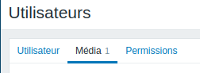
>
>
>
>On entre alors notre boite mail
>
>
>
>On voit bien le nouveau média pris en compte pour l'administrateur :
>
>

> **note – Création de l'alerte :**
>On va maintenant définir pour quelle problème notre admin reçoit une alerte mail.
>
>On va dans alertes > actions et on sélectionne action de déclencheur :
>
>
>
>On crée une action
>
>
>
>On nomme cette nouvelle action :
>
>
>
>On sélectionne ensuite l'élement qui envoi le mail :
>
>
>
>On choisi ensuite le problème pour lequel on veut être avertit :
>
>
>
>On va ensuite dans opétations et on en ajoute une :
>
>
>
>Enfin on sélectionne l'utilisateur ou les utilisateurs qui reçoivent l'alerte, ici l'admin reçoit une alerte mail.
>
>

> **note – Test :**
>On vérifie que l'alerte fonctionne, on éteint la VM et on vérifie que l'on réçoit bien l'alerte par mail.
>
>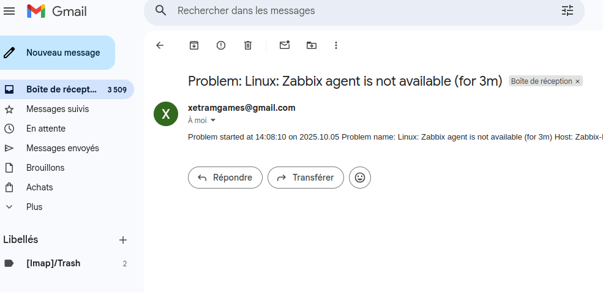
>
>On reçoit bien le mail après que la machine se soit éteint.
<br>

> **tip – Interface personnalisé :**
>Zabbix nous permet également de personnalisé notre interface pour plus de visibilité sur les équipements ou pour que l'on puisse se concentrer sur les éléments qui nous plaisent le plus.
>
>Un exemple d'interfaces personnalisé :
>
>
<br>

---
<div style="
    background-color: #4fc3f7;
    border-radius: 4px;
    padding: 10px;
    border: 2px solid #0288d1;
    box-shadow: 0 4px 8px rgba(0, 0, 0, 0.1);
    margin: 30px 0;
">
<h1 style="
    color: white;
    text-align: center;
    margin: 0;
    padding: 20px;
    text-shadow: 1px 1px 3px rgba(0, 0, 0, 0.3);
">Partie 2 – Comparaison avec PRTG</h1>
</div>
---
<br>
> **tip – Note :**
>PRTG est un autre logiciel de supervison de réseau. A la différence de Zabbix, il n'est pas open-source et il est payant. Voyons rapidement les avantages et les inconvénients des deux solutions Zabbix et PRTG pour déterminer laquelle est la plus adapté à nos besoins.
>
>Ci-dessous, un exemple d'une Interface PRTG :
>
>
<br>

> **note – Comparaison des deux solutions :**
>**Couts :**
>
>Zabbix est gratuit et open-source ce qui est un avantage sur son concurrent qui devient payant dès 100 capteurs, sachant que l'on peut déployer jusqu'à cinqs capteurs pour la surveillance d'une machine on arrive vite à la limite.
>
>On peut en revanche avoir recours à un support qui est lui payant pour Zabbix, bon à savoir en cas de problème.
>
>**Installation :**
>
>PPRTG est nettement plus simple à deployer que Zabbix qui nécessite des compétences en OS Linux, PRTG peu donc d'avérer une alternative pour un petit SI n'utillisant que Windows.
>
>**Cas d'usage recommandé :**
>
>**- PRTG :**
>
>Besoin d'une solution rapide à déployer et pour une équipe en info avec peu de connaissances en OS Linux, avec une infra windows dominante et si 100 capteurs suffisent ou que l'entreprise est prête à mettre le budget.
>
>**- Zabbix :**
>
>Zabbix est gratuit et ne nécessite que quelques compétences en Linux, adapté pour ceux qui préferent l'open source. De plus Zabbix est hautement customisable et peut donc être déployé pour des SI nécessitant du sur mesure. En plus comme c'est gratuit on peut l'utiliser pour de la supervision de grande échelle.
<br>

> **tip – Verdict :**
>La solution Zabbix est la plus adpaté à nos besoins, nottament pour L'AP en raison des grandes possibiltées de customisation, de plus j'ai une préférence à titre individuel pour les solutions open-source quand c'est possible.
